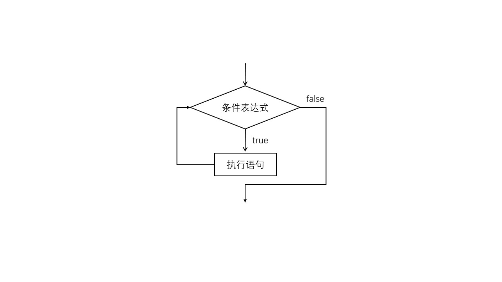
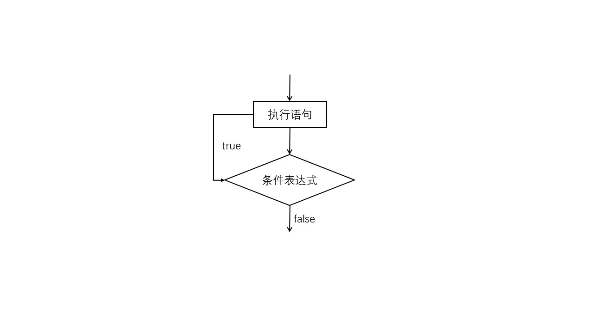
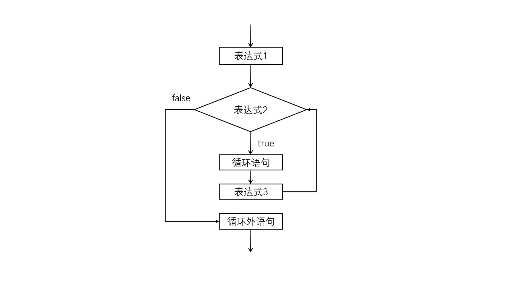

while：

```java
while(条件表达式){
    // 条件为true执行,为false退出
	// 执行语句
}
//执行完{}后当条件表达式的返回值为true时，执行" {} "中的语句；返回值为false时，退出循环。
```



do...while：

```java
do{
	// 执行语句
}while(条件表达式);
// 无论如何都会执行一次
```



for：

```java
for(表达式1;表达式2;表达式3){
	// 执行语句
}
/*
	表达式1：赋值表达式，负责设置循环的起始值，也就是给控制循环的变量赋初值
	表达式2：关系表达式，用控制循环的变量和循环变量允许的范围值进行比较
	表达式3：对控制循环的变量进行增大或减小
	执行流程：
		1、执行表达式1
		2、判断表达式2，true：执行for中嵌套语句，执行表达式3
					  false:结束循环
		3、返回表达式2继续执行
*/
for(;;){
    // 这是一个死循环
}
```



foreach语句：

```java
// 主要用于便利数组等
int arr[] = {4,2,5,7,3,6}
for(int a : arr){
    System.out.println(x);
}
```

<!-- 跳转语句 -->

break：跳出当前循环

```java
// 跳出外层循环
标签名 : 循环体{
    break 标签名;
}

BQ : for(;;){
    for(;;){
        break BQ; // 直接跳出外层循环
    }
}
```

continue：跳过本次循环，同样可以跳过外层循环，方法同上